  <picture>
    <source media="(prefers-color-scheme: dark)" srcset="dark.svg">
    <source media="(prefers-color-scheme: light)" srcset="light.svg">
    
  </picture>

---

### 👨‍💻 About Me

- 🎓 CSE (AI & ML) student, currently training at **NxtWave Academy**
- 🧠 On a mission to become an **AI Engineer**
- 🎨 Also work as a **Graphic Designer** — I mix logic with visuals
- 📊 Learning **Data Analysis with Pandas**, and grinding through **DSA** topic by topic
- 🌱 Currently building my portfolio, one project at a time
- ⚡ Fun fact: I design as sharply as I code — bold typography, clean grids, no clutter

---

### 🛠️ Tech Stack

**Languages & Core**

  
  
  

**Data & ML**

  
  
  

**Design**

  
  

**Tools**

  
  
  

---

### 📊 GitHub Stats

  
  

  

  

---

### 🌐 Connect with Me

  
  

---

  

<i>"Design with logic. Code with creativity."</i>

