  <picture>
    <source media="(prefers-color-scheme: dark)" srcset="light.svg">
    <source media="(prefers-color-scheme: light)" srcset="dark.svg">
    
  </picture>

---

### 👨‍💻 About Me

- 🎓 CSE (AI & ML) student
- 🧠 On a mission to become an **AI Engineer**
- 🎨 Also work as a **Graphic Designer** — I mix logic with visuals
- 📊 Learning **GEN AI**, and grinding through **DSA** topic by topic
- 🌱 Currently building my portfolio, one project at a time
- ⚡ Fun fact: I design as sharply as I code — bold typography, clean grids, no clutter

---

### 🛠️ Tech Stack

**Languages & Core**

  
  
  

**Data & ML**

  
  
  

**Design**

  
  

**Tools**

  
  
  

---
### 🚀 What I'm Focused On Right Now

- 🧩 Solving DSA problems daily — arrays through dynamic programming
- 📊 Practicing real-world problem solving skills
- 🎨 Building out a design portfolio alongside my technical work
- 📚  AI/ML career

### 📌 Featured Work

> Projects in progress — check back soon, or explore my [pinned repositories](https://github.com/vigky-in?tab=repositories) above.

| Project | Description | Status |
|---|---|---|
| DSA Practice | Topic-wise solved problems with notes | 🔄 In Progress |
| Pandas Projects | Data exploration & analysis notebooks | 🔄 In Progress |
| Design Portfolio | Selected Photoshop / graphic design work | 🔄 In Progress |

### 🌐 Connect with Me

  
  

---

  

<i>"Design with logic. Code with creativity."</i>

